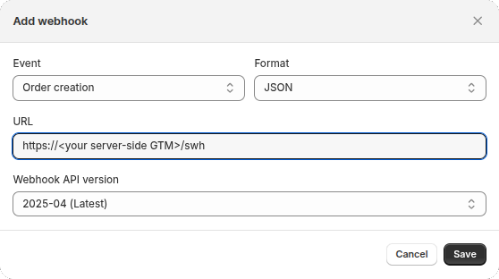

# Google Tag Manager Implementation for Shopify

This snippet should serve as a good generic starting point for shop owners working to integrate Google Analytics (GA4) via Google Tag Manager (GTM) into their Shopify store. It contains [a custom web pixel that forwards Shopify events to a client-side GTM container](#custom-web-pixel), and [a server-side GTM client template that can translate Shopify's `Order creation` webhook to a `purchase` event in a server-side GTM container](#webhook-client).

## Custom web pixel

### Installation

#### Shopify custom pixel

Create a [Shopify custom pixel](https://help.shopify.com/en/manual/promoting-marketing/pixels/custom-pixels/code) using the code in [shopify-pixel.js](./shopify-pixel.js).

> [!IMPORTANT]
> Be sure to replace the generic `GTM-XXXXXXX` value with your GTM container ID.

> [!NOTE]
> Your theme may override functionality, which may interfere with the execution of default Shopify events. Be sure to test your theme.

#### Prepare GTM

1. Add a GA4 tag to your GTM container.
2. Add triggers for the following events:
   - `purchase`
   - `add_payment_info`
   - `add_address_info`
   - `add_shipping_info`
   - `add_contact_info`
   - `begin_checkout`
   - `remove_from_cart`
   - `view_cart`
   - `add_to_cart`
   - `view_item`
   - `view_item_list`
   - `search`
   - `page_view`

#### Optional: Add more `Shopify.analytics.publish()` calls to your theme

There may be certain scenarios where you would want to track events that Shopify does not provide by default. You can add these to your theme by implementing calls like this:

```javascript
Shopify.analytics.publish('custom_event', {
  event: 'event_name',
  key1: 'value1',
  key2: 'value2'
});
```

You are free the change the value of `event`, and the key-value pairs, of course.

### How to test

[Shopify custom pixels](https://help.shopify.com/en/manual/promoting-marketing/pixels/custom-pixels/code) create a sandboxed environment with access to [standard events](https://shopify.dev/docs/api/web-pixels-api/standard-events). The sandboxed environment runs pixel code in an HTML `<iframe>`, which does not play well with GTM's Tag Assistant. As a result, confirming the installation and debugging may be a bit of a challenge. My approach has been to add `console.log` calls with the `dataLayer` object and check the developer console.


## Webhook client

As a first step, set up [server-side GTM](https://developers.google.com/tag-platform/tag-manager/server-side). [This article by Simo Ahava's](https://www.simoahava.com/analytics/server-side-tagging-google-tag-manager/) might help as well. Then:

### In shopify

Go to _Settings_ > _Notifications_ > _Webhooks_ > _Create webhook_ and add the following webhook:



Note the `/swh` at the end.

### In the server-side GTM container

1. Go to _Templates_ > _Client Templates_ > _New_
2. Click _⋮_ > _Import_
3. Pick `shopify-webhook-client.tpl` and click _Save_
4. Go to _Clients_ > _New_ and add a client with the imported template
5. Add the tags you want. Use `purchase` as _Event name_ in your triggers.

### How to test

I have used a free [Webhook Relay](https://webhookrelay.com/) account to temporarily add the `X-Gtm-Server-Preview` using the following transformation:

```lua
local shopifyTest = r.RequestHeader["X-Shopify-Test"]

if shopifyTest == "true" then
  r:SetRequestHeader("X-Gtm-Server-Preview", cfg:GetValue("X-Gtm-Server-Preview"))
end
```

Then replace your SSGTM endpoint in the Shopify webhook with Webhook Relay's and have Webhook Relay forward it to SSGTM instead. This will make test events (_…_ > _Send test_ from the webhook in Shopify) show up in GTM's _Preview_. Do not forget to replace your SSGTM endpoint in Shopify when you're done.

## Credits

- All credits for the foundation [this pixel](#custom-web-pixel) was built on go to <https://github.com/lstellway/snippets>
